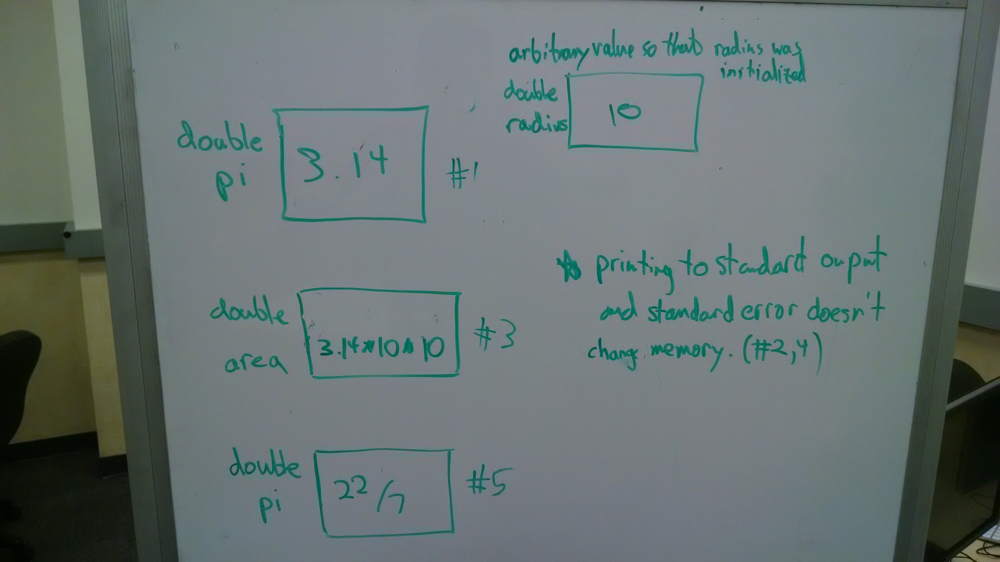

# Code to English 

**Code**: `double pi = 3.14;`

**English**: pi is a double whose value is 3.14

---

**Code**: `double area = pi * radius * radius;`

**English**: area is adouble whose value is the value of "pi" times the value of "radius" times the value of "radius"

---

**Code**: `cout << "The area is: " << area << endl;`

**English**: print "the area is:" and then the value of area and then an endline to the standard out

---

**Code**: `pi = 22/7;`

**English**: the value of pi is now twenty two divided by seven

---

**Code**: `cerr << "Is the value of area updated?" << endl;`

**English**: print :Is the value of area updated?" and then an endline to standard error

# English to Code

**English**: mass is a double whose value is 4.5.

**Code**: `double mass = 4.5;`

---

**English**: acceleration is a double whose value is 5.2.

**Code**: `double acceleration = 5.2;`

---

**English**: Print the string "mass times acceleration is" and then the value of mass times the value of acceleration and then an endline to standard output.

**Code**: `cout << "mass times acceleration is" << mass * acceleration << endl;`

---

**English**: force is a double whose value is the value of mass.

**Code**: `double force = mass;` 

---

**English**: the value of force is now the value of force times the value of mass.

**Code**: `force = force * mass;`

---

# Code to Memory Model 

