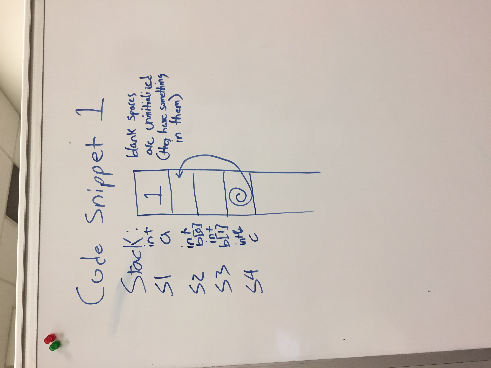
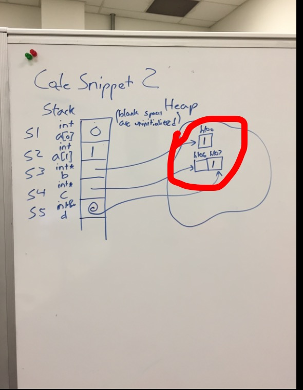
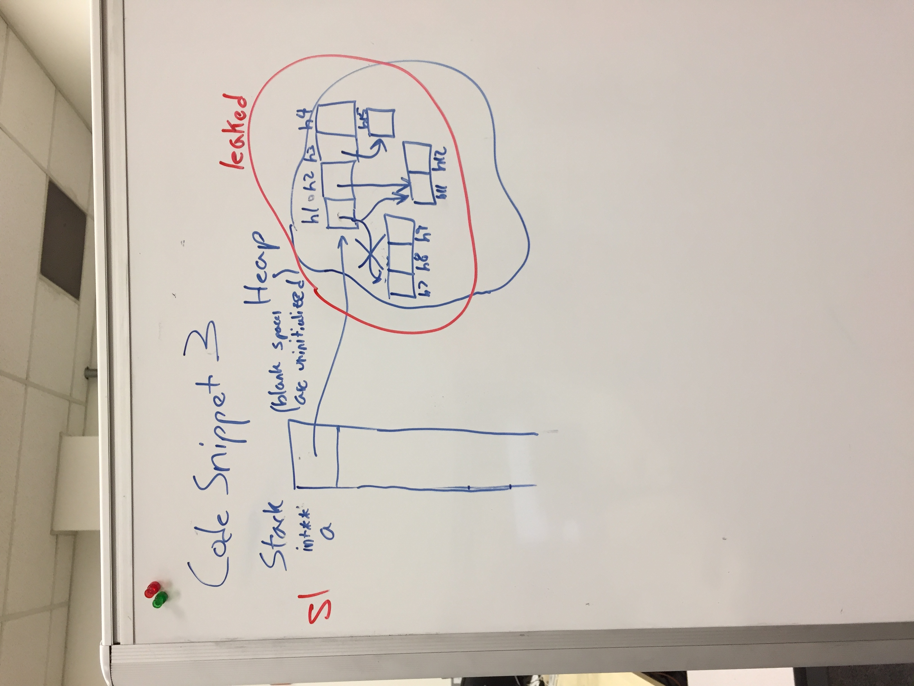
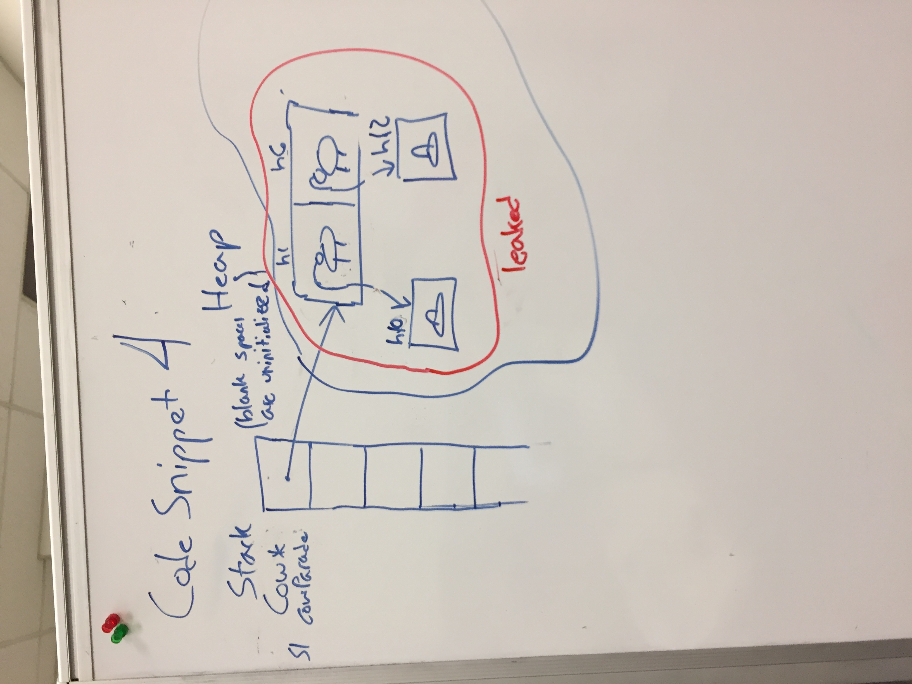
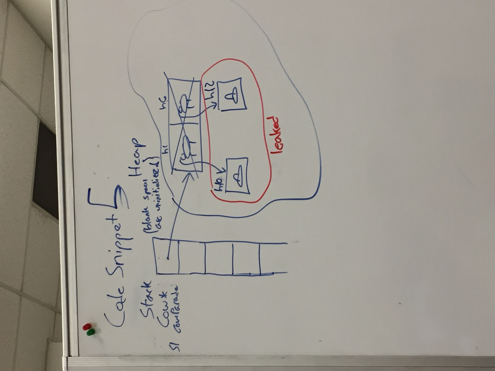
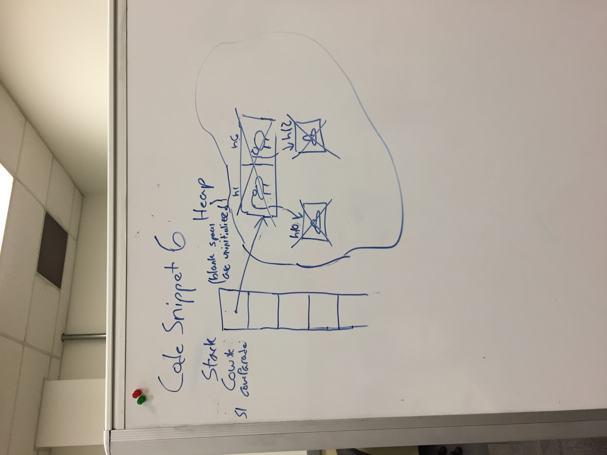

# Code Snippet 1

**main.cpp**: 

```c++
{
  int a = 1;
  int b[2];
  int& c = b[1];
}
```

**Memory Model**:

At the closing curly brace of `main.cpp`, memory looks like:



---

# Code Snippet 2

**main.cpp**:

```c++
{
  int a[2] = {0, 1};
  int* b = new int;
  int* c = new int[2];
  int& d = c[1];
  d = a[1];
  *b = d;
}
```

**Memory Model**:

At the closing curly brace of `main.cpp`, memory looks like:



Annotations to avoid leaked memory:

delete b;
delete[] c;

---

# Code Snippet 3

**main.cpp**:

```c++
{
  int** a = new int*[4];
  a[0] = new int[3];
  a[1] = new int[2];
  a[2] = new int;
  a[0] = a[1];
}
```

**Memory Model**:

At the closing curly brace of `main.cpp`, memory looks like:




Annotations to avoid leaked memory:

(before assigning a[0] to be a[1]) 
delete[] a[0];

(At the end of the code)
delete[] a[0];
delete a[2];
delete[] a;
---

# Code Snippet 4

**cow.hpp**:

```c++
class Cow {
  public:
    Cow();
}
```

**cow.cpp**:

```
Cow::Cow(): hat_(new Hat) 
{ }
```

**main.cpp**:

```
{
  Cow* cowParade = new Cow[2];
}
```

**Memory Model**:

At the closing curly brace of `main.cpp`, memory looks like:



Annotations to avoid leaked memory:

delete cowParade[0].hat_;
delete cowParade[1].hat_;
delete[] cowParade;

---

# Code Snippet 5

**cow.hpp**

```c++
class Cow {
  public:
    Cow();
  private:
    Hat* hat_;
};
```

**Cow.cpp**
```
Cow::Cow(): hat_(new Hat) 
{ }
```

**main.cpp**

```c++
Cow::
{
  Cow* cowParade = new Cow[2];
  delete[] cowParade;
}
```

**Memory Model**:

At the closing curly brace of `main.cpp`, memory looks like:




Annotations to avoid leaked memory:

Cow needs to have a destructor because we we can't delete the hat_ members of Cows. hat_ is a private data member.


---

# Code Snippet 6


**cow.hpp**

```c++
class Cow {
  public:
    Cow();
    ~Cow();
  private:
    Hat* hat_;
};
```

**Cow.cpp**

```
Cow::Cow(): hat_(new Hat) 
{ }

Cow::~Cow() {
  delete hat_;
}
```

**main.cpp**

```c++
Cow::
{
  Cow* cowParade = new Cow[2];
  delete[] cowParade;
}
```

**Memory Model**:

At the closing curly brace of `main.cpp`, memory looks like:


